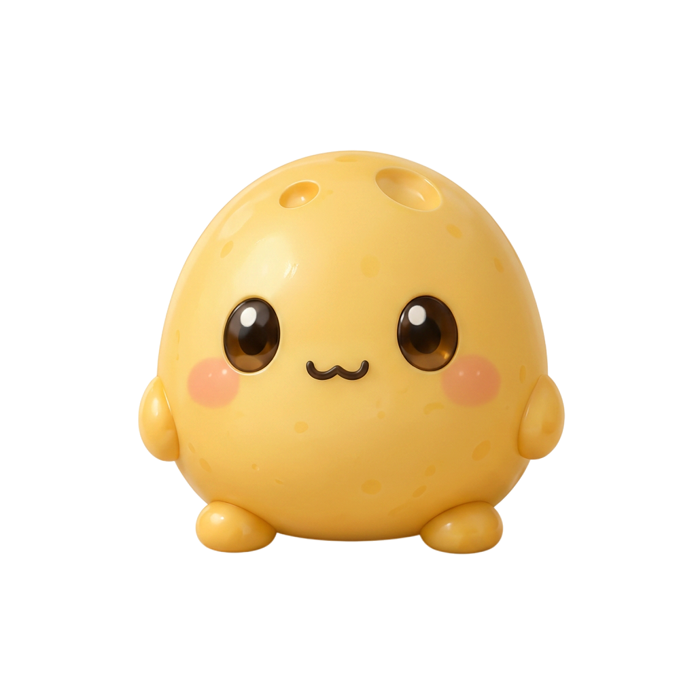
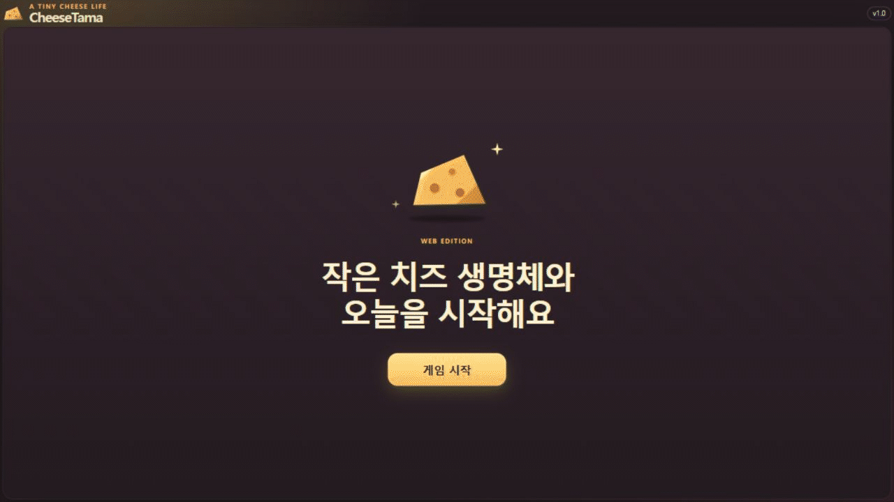
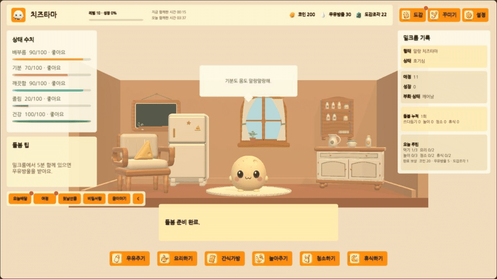
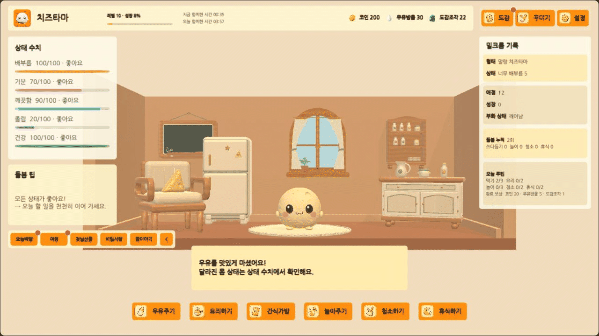

  

<h1 align="center">CheeseTama: The Milkroom</h1>

  우유를 먹이고, 함께 놀고, 하루의 작은 변화를 지켜보세요. 
  포근한 방에서 나만의 치즈 생명체를 돌보는 캐주얼 육성 게임입니다.

> [!NOTE]
> [웹에서 치즈타마 플레이하기](https://cheezcyj.github.io/CheeseTama/play/)
> 접속되지 않으면 [최근 배포 상태](https://github.com/cheezcyj/CheeseTama/actions/workflows/webgl-release.yml)를 확인해 주세요. 아래 시연을 보거나 Unity에서 직접 실행할 수도 있습니다.

## 어떤 게임인가요?

치즈타마는 작은 치즈 생명체와 일상을 함께하는 게임입니다. 배가 고프면 먹을 것을 챙겨 주고, 심심해하면 놀아 주고, 피곤해하면 쉬게 해 주세요. 돌봄을 이어 가면 모습이 달라지고 새로운 이야기와 수집 요소를 만날 수 있습니다.

- **돌보기:** 우유·요리·간식, 청소와 휴식으로 상태를 챙깁니다.
- **함께 놀기:** 짧은 미니게임을 즐기고 캐릭터의 반응을 살펴봅니다.
- **발견 모으기:** 도감, 생활 기록, 성장 여정을 하나씩 채웁니다.
- **방 꾸미기:** 장식과 시간대별 분위기를 골라 나만의 밀크룸을 만듭니다.

## 짧게 구경하기

Unity 플레이 모드의 실제 실행 화면을 짧은 GIF로 담았습니다. 시연에는 예시 진행 데이터를 사용했습니다. 상단 이미지는 캐릭터 참조 그림이며, 게임 속 모습은 성장 단계에 따라 달라집니다.

### 1. 밀크룸에 들어가기

시작 화면에서 입장하고, 게스트로도 가볍게 게임을 시작할 수 있습니다.

### 2. 치즈타마 돌보기

상태를 살피고 돌봄 메뉴를 선택해 보세요. 캐릭터와 방 안의 물건도 눌러 볼 수 있습니다.

### 3. 발견한 기록 보기

도감에서 지금까지 모은 발견을 확인하고, 다시 방으로 돌아옵니다.

## 기본 조작

마우스로 메뉴와 캐릭터를 누르면 됩니다. 터치 입력도 지원합니다. 키보드를 사용할 때는 아래 단축키를 쓸 수 있습니다.

| 키 | 동작 |
| --- | --- |
| `1`–`6` | 우유 · 요리 · 간식 · 놀이 · 청소 · 휴식 |
| `C` | 도감 열기 |
| `D` | 꾸미기 열기 |
| `Esc` | 열린 화면 닫기 |

## 직접 실행해 보기

[웹 플레이 주소](https://cheezcyj.github.io/CheeseTama/play/)를 브라우저에서 열거나, 아래 순서로 Unity에서 실행할 수 있습니다.

### 준비물

- Unity Hub와 Unity **`6000.0.78f1`**
- Git — 일부 Unity 패키지를 내려받는 데 필요합니다.
- 패키지 설치를 위한 인터넷 연결

### 시작 순서

1. 저장소를 내려받습니다. Unity Hub에서 `Assets`, `Packages`, `ProjectSettings`가 들어 있는 폴더를 프로젝트로 추가합니다.
2. 지정된 Unity 버전으로 열고, 패키지 설치와 에셋 임포트가 끝날 때까지 기다립니다.
3. `Assets/_Project/Scenes/Boot.unity`를 엽니다.
4. Unity Editor의 **Play** 버튼을 누르고 시작 화면의 안내에 따라 입장합니다.

처음 열 때는 패키지 다운로드와 에셋 임포트에 시간이 걸릴 수 있습니다. Git 패키지 설치에 실패하면 Git이 설치되어 있는지 확인한 뒤 Unity Hub와 Editor를 다시 실행해 주세요.

## 내 기록은 어디에 저장되나요?

게임 기록은 실행한 기기나 브라우저에 저장됩니다. 기본 구성에는 기기 간 자동 동기화가 없습니다.

- **Unity에서 실행할 때:** 게임 기록은 현재 기기의 로컬 저장 영역에 보관됩니다.
- **WebGL 빌드를 실행할 때:** 게임 기록은 현재 브라우저의 저장 영역에 보관됩니다. 브라우저·프로필·게임 주소가 바뀌면 기존 기록을 읽지 못할 수 있습니다.
- **게임 안의 로컬 계정:** 현재 실행 환경 안에서 기록을 나누는 기능입니다. 온라인 서비스 계정이 아니며, 다른 기기에서 같은 계정으로 진행 상황을 자동으로 불러오지 않습니다.

중요한 기록은 **설정 → 백업 저장 만들기**로 보관하세요. 나중에 **설정 → 백업 저장 가져오기**로 불러올 수 있습니다. 이 백업에는 게임 진행 상황이 담기며, 로컬 계정이나 로그인 정보를 다른 기기로 복제하지는 않습니다.

> [!IMPORTANT]
> 브라우저의 사이트 데이터를 삭제하거나 비공개 모드 창을 닫으면 WebGL 기록이 사라질 수 있습니다. 중요한 기록은 별도로 백업해 주세요.

> [!CAUTION]
> 백업 파일은 암호화되지 않은 게임 기록입니다. 공개 저장소나 게시판에 올리지 마세요. 로컬 계정에도 다른 서비스에서 사용하는 중요한 비밀번호를 재사용하지 않는 것을 권장합니다.

## 개발 문서

Unity와 C#으로 개발하고 있습니다. 소스 구조와 WebGL 빌드 방법은 아래 문서를 참고하세요.

- [프로젝트 구조 안내](Docs/PROJECT_STRUCTURE.md)
- [WebGL 빌드·배포 안내](Docs/WebGL-Deployment.md)

## 라이선스

프로젝트 라이선스는 [MIT LICENSE](LICENSE)를 확인해 주세요. 포함된 나눔고딕 글꼴은 [SIL Open Font License 1.1](Assets/_Project/ThirdParty/Fonts/NanumGothic/OFL.txt)에 따라 제공됩니다.
